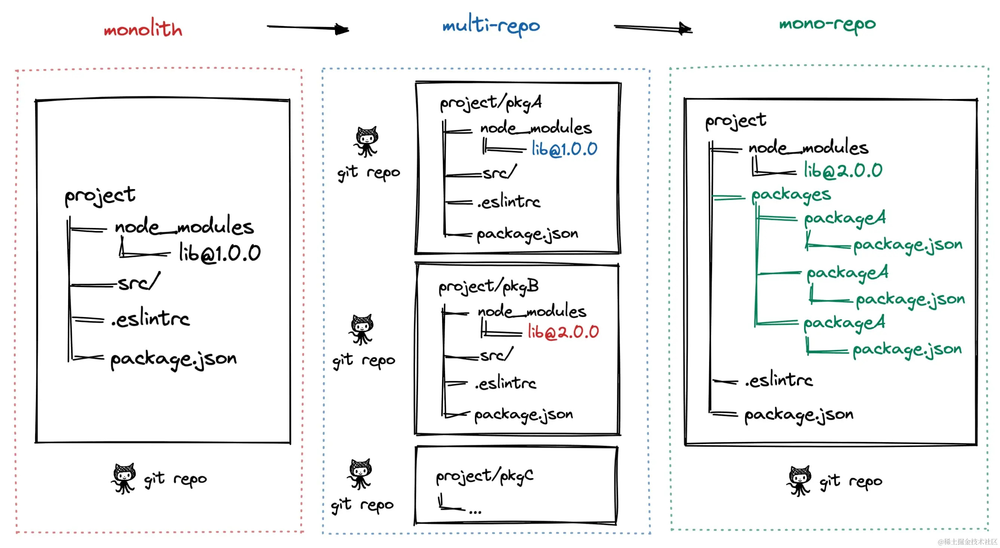
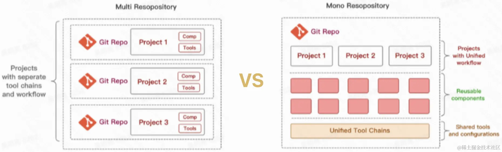

# 什么是 Monorepo

## 前言

最近入职了一家新公司，公司代码采用了前端 React、后端 nest.js 的技术栈，很多方法都是可以前后端公用的，前后端所有的代码都放在同一个代码仓库中，采用了 monorepo 的代码管理方案，在这里开始了解一下什么是 monorepo，以及 对应的 multi-repo 有什么区别。

## 什么是 Monorepo

所谓的 `Monorepo` 就是一个 git 仓库，里面存放着多个项目，这样的项目被称为工作空间或者包,这些包可以相互依赖，也可以完全不相关。与此相反，使用多个 git 仓库，每个 git 仓库只存放一个项目，称为 `Multi-repo` 方式。也可以将这两种方式的结合起来使用。
越来越多的公司开始使用 Monorepo 作为公司代码仓库的管理方案，包括 Google、Facebook、Twitter 。想象一下，想 Babel、React、Ember 这样的项目，他们由一
个核心的包组成，可以通过包形式的附加组件和功能进行扩展，在一个存储库中同时管理项目的 Core 和 plugin 使得维护代码的代价更小，也能更好的保持所有版本依赖保持同步。

## Monorepo 的进化之路

**阶段一：单仓库巨石应用** 一个 git 仓库维护所有的代码，随着代码量的逐渐扩大和业务量的逐步上升，项目代码会越来越大，越来越复杂，大量代码的构建效率降低，最后导致了单仓库巨石应用，称为 `Monolith`。  
**阶段二：多仓库多模块应用** 随着代码量的增多，将整体业务拆解成为多个业务模块，各自做为一个 `git仓库管理`,模块之间解耦合，降低了 巨石应用的复杂度，每个模块都可以单独编码、测试、发版，构建效率得到很大的提升，这种代码管理方式称为 `Multi-repo`.  
**阶段三：单仓库多模块应用** 随着业务模块继续增加，模块仓库的数量也在不断增多，Multi-repo 方式虽然从业务上解耦合，但也增加了项目工程管理的难度，随着模块仓库达到一定的数量级，会有几个问题： 跨仓库代码很难共享，分散在单仓库的模块依赖管理复杂，
底层模块升级，上层依赖模块都要及时更新，否则就存在依赖问题，增加了构建耗时（一个底层模块提交更新，所有依赖模块都要做依赖更新及 git 提交，发版，非常耗时耗力），于是将多个项目集成到一个仓库下，共享仓库配置，共享模块代码，共享第三方依赖（保证了三方依赖的版本统一）称为趋势，这种代码管理方式称之为 `MonoRepo`.



### Monorepo 的优劣



| 场景       | MultiRepo                                                                                                                                                                                                                                                     | MonoRepo                                                                                                                                                                                                                                                                                                                                                                     |
| ---------- | ------------------------------------------------------------------------------------------------------------------------------------------------------------------------------------------------------------------------------------------------------------- | ---------------------------------------------------------------------------------------------------------------------------------------------------------------------------------------------------------------------------------------------------------------------------------------------------------------------------------------------------------------------------- |
| 代码可见性 | ✅ 代码隔离，研发者只需要关注自己负责的仓库<br/> ❌ 管理按照各自的 Owner 划分，当出现问题时，需要到依赖包中进行判断并解决                                                                                                                                     | ✅ 一个仓库中由多个相关项目，可以看到整个代码库的变化趋势，更好的团队协作 <br/>❌ 增加了非 Owner 代码改动的风险                                                                                                                                                                                                                                                              |
| 依赖管理   | ❌ 多个仓库都有自己的 node_modules                                                                                                                                                                                                                            | ✅ 所有的项目在一个文件夹中，依赖提升，共享一个 node_modules                                                                                                                                                                                                                                                                                                                 |
| 代码权限   | ✅ 每个仓库都可以设置自己的代码权限，不会出现项目被误改的情况                                                                                                                                                                                                 | ❌ 多个项目代码在同一个仓库中，没有项目粒度的权限 ，一个项目出问题，可能影响到所有项目                                                                                                                                                                                                                                                                                       |
| 开发迭代   | ✅ 仓库体积小，模块划分清晰，可维护性强 <br/>❌ 多仓库来回切换（编辑器和命令行），项目多时效率很低，存在相同依赖时，需要手动 npm link，操作繁琐 <br/>❌ 依赖管理不便，多个依赖可能在不同的项目中存在不同的版本，重复安装，npm link 时不同项目的依赖会存在冲突 | ✅ 多个代码在同一个仓库中，可以看到相关项目的全貌，编码非常方便<br/> ✅ 代码复用高，方便进行重构 ❌ 多个项目在同一个项目中，代码体积很大，git clone 操作时间很长， 在开发过程中 rebase 会很耗费时间，需要经常 rebase，特别是多人开发相同模块的时候，容易冲突 <br/> ✅ 依赖调试方便，在迭代依赖包的时候，只需要 npm link 一次，就可以在多个项目中查看修改效果，简化了操作流程 |
| 工程配置   | ❌ 各个仓库各自维护一套构建、打包、代码校验，不一致时或者需要构建优化时可能导致代码差异和构建差异                                                                                                                                                             | ✅ 多个项目在同一个仓库，共用同一套工程配置逻辑，代码风格、代码质量标准容易把控                                                                                                                                                                                                                                                                                              |
| 构建部署   | ❌ 各个仓库存在相同的依赖升级时，需要手动到各个仓库修改依赖版本，构建和部署，非常消耗时间                                                                                                                                                                     | ✅ 构建 Monorepo 工具可以配置依赖项目的构建优先级，可以实现一次命令完成所有部署                                                                                                                                                                                                                                                                                              |

## MonoRepo 的场景

综合以上所述， MonoRepo 的管理方式更适用于 `中大型项目，多模块项目`，在开发效率、协作效率、综合管理、代码一致性等方面都有很大收益

## MonoRepo 踩坑

一、**幽灵依赖**

**问题：** npm、yarn 安装的依赖，存在依赖提升，即所有的依赖全部摊平到同一层级，这就导致一些没有在 package.json 中引入的依赖包，也可以在项目中直接使用，这种行为就叫做 **"幽灵依赖"**，幽灵依赖最大的问题在于，如果某个幽灵依赖不再被其他包使用，不再被安装，那么项目就会因为无法找到依赖而报错。

**解决方案：** 基于 npm、yarn 的 Monorepo 的方案依然存在幽灵依赖的问题，目前可以使用 `pnpm`彻底解决这个问题。

二、**依赖安装耗时长**

**问题：** MonoRepo 中每个项目都有自己的 package.json 依赖表，嘴着 MonoRepo 中依赖增常，每次 install 的耗时会越来愈长  
**方案：** 相同版本的依赖可以提升到 MonoRepo 根目录下，减少冗余依赖的安装，使用 pnpm 按需安装及依赖缓存

三、**构建打包时间长**  
**问题：** 多个项目构建任务存在依赖时，往往是串行构建或者全量构建，导致构建时间长  
**方案：** 增量构建，而非全量构建，也可以将串行构建优化成并行构建。

## Monorepo 选型

### 构建型

目前市面上有很多基于 Monorepo 思想构建的工具，主要解决大仓库 Monorepo 构建效率低的问题。项目代码越来越大，工作流程（项目 init、构建、单元测试、集成测试）越来越慢；这类工具就是针对这样的场景进行极致的性能优化。适用于包非常多、代码量非常庞大的 Monorepo 项目。

### 轻量型

#### Lerna

**Lerna 是什么？**

- Lerna 是 Babel 为实现 MonoRepo 开发的工具；最擅长依赖关系和发布
- Lerna 优化了多包工作流，解决了多包依赖、发版手动维护等问题
- Lerna 不提供构建、测试等任务，工程能力较弱，项目中往往需要基于它进行顶层能力的封装

**Lerna 主要做的三件事**

- 为单个包或者多个包运行命令 （lerna run）
- 管理依赖项 （lerna bootstrap）
- 发布依赖包，处理版本管理，并声称变更日志（lerna publish）

**Lerna 解决了什么问题？**

- **代码共享、调试便捷：** 一个依赖包更新，其他依赖包无需安装最新版本，因为 lerna 会自动 link
- **安装依赖，减少冗余** 多个包使用相同版本的依赖包时，Lerna 优先将依赖包安装在根目录
- **规范版本管理：**Lerna 通过 Git 检测代码变动，自动发版，更新版本好，两种模式管理多个依赖包的版本号
- **自动生成发版日志：** 使用插件，根据 Git commit 记录，自动生成 ChangeLog

**Lerna 自动检测发布，判断逻辑**

1. 校验本地是否有没有被 commit 内容？
2. 判断当前的分支是否正常？
3. 判断当前分支是否在 remote 存在？
4. 判断当前分支是否在 lerna.json 允许的 allowBranch 设置之中？
5. 判断当前分支提交是否落后于 remote

**Lerna 工作模式**  
Lerna 可以使用两种模式来管理项目 **固定模式** 所有的包都拥有同样的版本、**独立模式** 包可以拥有自己的单独版本号

#### yarn\npm + workspace

yarn 1.x 及以上版本，新增 workspace 能力，不借助 Lerna ，也可以提供原声的 Monorepo 支持，需要在根目录下 package.json 中，声明 workspace

```js
{
    "private":true, // 必须是私有项目
    "workspaces": {
        "packages": [
            "packages/backend",
            "packages/frontend",
            "packages/shared",
            "vendors/**"
        ]
    },
}
```

**yarn workspace VS Lerna**

- yarn workspace 更突出对依赖的管理： 依赖提升到根目录的 node_modules 下，安装更快，体积更小

- Lerna 更突出工作流方面：使用 Lerna 命令来优化多个包的管理，如：依赖发包、版本管理，批量执行脚本

将二者结合起来使用，会形成更佳方案： **yarn workspace + Lerna**

能力分工：Lerna 将依赖管理交给 yarn workspace；Lerna 承担依赖发布能力。

**操作步骤：**

1. 配置 Lerna 使用 Yarn 管理依赖：learn.json 中配置 "npmClient": "yarn"
2. 配置 Lerna 启用 Yarn Workspaces：

> 配置 lerna.json/useWorkspaces = true
> 配置根目录 package.json/workspaces = ["packages/*"] , 此时 lerna.json 中的 packages 配置项将不再使用.
> 配置根目录 package.json/private = true

说明：
上面三个配置项需同时开启, 只开启一个 lerna 会报错
此时执行 lerna bootstrap 相当于执行 yarn install，等同于执行 lerna bootstrap --npm-client yarn --use-workspaces
由于 yarn 会自动 hosit 依赖包, 无需再 lerna bootstrap 时增加参数 --hoist (加了参数 lerna 也会报错)

不需要发包的项目，配置 package.json/private = true

#### Lerna + pnpm + workspace

**pnpm 是新一代 Node 包管理器**，它由 npm/yarn 衍生而来，解决了 npm/yarn 内部潜在的风险，并且极大提升依赖安装速度。pnpm 内部使用基于内容寻址的文件系统，来管理磁盘上依赖，减少依赖安装；node_modules/.pnpm 为虚拟存储目录，该目录通过<package-name>@<version>来实现相同模块不同版本之间隔离和复用，由于它只会根据项目中的依赖生成，并不存在提升。
**CAS 内容寻址存储**，是一种存储信息的方式，根据内容而不是位置进行检索信息的存储方式。  
**Virtual store 虚拟存储**，指向存储的链接的目录，所有直接和间接依赖项都链接到此目录中，项目当中的.pnpm 目录

**pnpm 相比于 npm、yarn 的包管理器，优势如下，同理是 Lerna + yarn + workspace 优势：**

- **装包速度极快**： 缓存中有的依赖，直接硬链接到项目的 node_module 中；减少了 copy 的大量 IO 操作
- **磁盘利用率极高**： 软/硬链接方式，同一版本的依赖共用一个磁盘空间；不同版本依赖，只额外存储 diff 内容
- **解决了幽灵依赖**： node_modules 目录结构 与 package.json 依赖列表一致

## 选型建议

建议采用渐进式架构方案，即对于轻量级 Monorepo 项目，我们初期可以选择 `Lerna + pnpm workspace + lerna-changelog`，解决了依赖管理、发版管理等问题，为开发者带来便利；随着后续项目迭代，代码变多或多个项目间依赖关系复杂，可以很平滑的接入 Nx 来提升构建打包效率。

## 用法

### 初始化项目

```ssh
npm init -y

```

### 声明本项目是 workspaces 模式

private 必须设为 true，声明本项目不会被发布到 npm，因为 npm 包不支持 monorepo 的形式

```json
  "private":"true",
  "workspaces": [
    "packages/*"
  ],

```

workspaces 功能与 lerna 类似，如果只需简单地管理多个包，workspaces 足够了。lerna 具有版本管理，发包提示，简化多包项目发布流程等更多功能。

## 注意

1. 使用 monorepo 时，需要在 package.json 中添加 private=true，否则会报错(因为 monorepo 应用并不是一个可以 npm publish 的包，它只是包管理工具)

## monorepo 实际解决的问题

Monorepo 给人的“复杂感”很正常——它本质上是用“前期架构设计的复杂度”换取“后期多项目协作的效率”，尤其当你需要在同一个仓库管理多框架（Vue/React）、多服务（前端/后端）时，这种复杂度会更明显。具体来说，这种“复杂感”主要来自以下几个方面：

### 一、Monorepo 解决的问题本身就复杂

Monorepo 不是为“单一应用”设计的，而是为解决**“多项目协同开发的痛点”**（如代码复用、版本同步、跨项目调试）。这些问题本身就比“单项目开发”更复杂：

- 单仓库（Polyrepo）里，一个功能可能需要改 3 个仓库（前端 A、前端 B、后端），提交 3 次 PR，协调 3 个仓库的版本发布，容易出现“版本不同步”“代码重复”的问题。
- Monorepo 把这些项目集中到一个仓库，看似“管得多了”，但本质是把“跨仓库的隐性复杂”变成了“单仓库内的显性规则”。

这种“显性规则”（如目录结构、依赖管理、构建流程）正是初期觉得复杂的原因——你需要为多项目制定统一的“游戏规则”，而单项目根本不需要这些。

### 二、核心复杂度来源：“共享”与“隔离”的平衡

Monorepo 的核心矛盾是**“如何让多项目高效共享代码，同时保持各自的独立性”**，这需要精细设计，否则会陷入“混乱的单体”：

1. **目录结构的复杂度**  
   单项目只需要一个`src/`，而 Monorepo 必须区分“应用”（`apps/`）和“共享包”（`packages/`），还要考虑：

   - 哪些代码该抽成共享包？（抽太多会碎片化，抽太少则复用性差）
   - 共享包之间是否允许互相依赖？（比如`ui-vue`能否依赖`shared-utils`？）
   - 应用如何引用共享包？（本地路径？workspace 协议？）

   这些决策比单项目的目录设计（`src/pages`/`src/components`）复杂得多。

2. **依赖管理的复杂度**  
   单项目的`node_modules`只需管理自身依赖，而 Monorepo 要处理：

   - 哪些依赖是“全局共享”的（如`typescript`）？哪些是“应用专属”的（如`vue`/`react`）？
   - 共享包的版本如何管理？（本地开发用`workspace:*`，发布时如何同步版本？）
   - 不同应用依赖同一包的不同版本时，如何避免冲突？（比如 A 用`lodash@4`，B 用`lodash@3`）

   这些问题在单项目中几乎不会遇到，但在 Monorepo 中必须解决，否则会出现“构建失败”“运行时错误”。

3. **工程化配置的复杂度**  
   单项目一套 ESLint/构建配置即可，而 Monorepo 要做到：

   - 统一基础规范（如代码格式化、提交规范），避免“各写各的”。
   - 允许应用按需扩展（如 Vue 用`vue-eslint`，React 用`react-eslint`）。
   - 构建/测试时只处理“有变更的项目”（否则全量构建太慢）。

   这需要设计“基础配置 + 应用配置”的继承关系，甚至引入`nx`/`turbo`等工具管理任务依赖，初期配置成本很高。

### 三、工具链的“选择困难”加剧复杂感

Monorepo 没有“官方标准”，工具链太多（pnpm workspace、nx、turborepo、lerna 等），每个工具都有自己的概念和配置方式：

- 用 pnpm workspace 吧，需要学`pnpm-workspace.yaml`、`workspace:*`依赖协议、`--filter`筛选命令。
- 用 nx 吧，要理解“任务流水线”“缓存策略”“生成器”，配置文件`nx.json`一堆字段。
- 甚至只是“如何启动一个应用”，单项目是`npm run dev`，Monorepo 可能要记`pnpm --filter app-name dev`。

这种“工具学习成本”叠加到项目复杂度上，很容易让人觉得“太麻烦”。

### 四、“复杂度”与“项目规模”正相关

Monorepo 的复杂感会随项目数量增加而放大：

- 如果你只管理 2 个项目（1 个前端 + 1 个后端），可能觉得“还好”——目录结构简单，依赖冲突少。
- 但当项目增加到 5 个（Vue 管理端、React 管理端、H5、后端 API、小程序），共享包增加到 4 个（类型、工具、UI 组件、API 客户端），此时“共享与隔离”的设计稍有不慎就会出问题，复杂度会明显上升。

很多人觉得复杂，是因为一开始就按“未来可能有 10 个项目”的规模设计，引入了过多暂时用不上的工具和规范。

### 如何缓解“复杂感”？

Monorepo 的核心是“按需设计”，不必追求“一步到位”：

1. **从小规模起步，拒绝过度设计**

   - 初期只管理 2-3 个核心项目（如`api`+`admin-vue`），共享包只抽`shared-types`（必须共享的类型），其他代码先不抽。
   - 工具选最简单的（pnpm workspace 足够），不急于引入 nx/turbo（等项目多了再考虑）。

2. **明确“共享边界”，减少决策成本**

   - 制定简单规则：如“只有 3 个以上项目需要的代码才抽成共享包”“共享包不允许依赖应用”。
   - 目录结构固定为`apps/`（应用）+`packages/`（共享包），不搞嵌套子目录（如`apps/admin/vue`这种只会增加复杂度）。

3. **用自动化工具替代手动操作**

   - 写脚本简化重复操作：如`scripts/create-app.sh`自动创建新应用并初始化配置，`scripts/deploy.sh`一键部署指定应用。
   - 依赖工具的“约定优于配置”：如 pnpm workspace 自动识别`apps/*`，无需手动列应用列表。

4. **接受“初期成本”，关注长期收益**  
   当项目超过 3 个，Monorepo 的优势会逐渐显现：
   - 改一个共享工具函数，所有依赖它的项目自动生效（不用逐个仓库发版更新）。
   - 前端和后端共用一套`User`类型，接口联调时少了 80%的“类型不匹配”问题。
   - 新人入职只需克隆一个仓库，就能跑通所有项目（不用配置 5 个仓库的环境）。

### 总结

Monorepo 的“复杂”是“多项目协作”问题的显性化，它不是“制造复杂”，而是“解决隐藏的复杂”。对于需要长期维护的多框架/多服务项目，初期花 1-2 周搭建基础架构，后期能节省大量跨项目协调的时间。

如果你的项目规模很小（只有 1 个前端 + 1 个后端，且未来不会拓展），Monorepo 确实“没必要”；但如果像你计划的那样，未来要拓展 React、H5 等应用，Monorepo 的前期投入是值得的。
