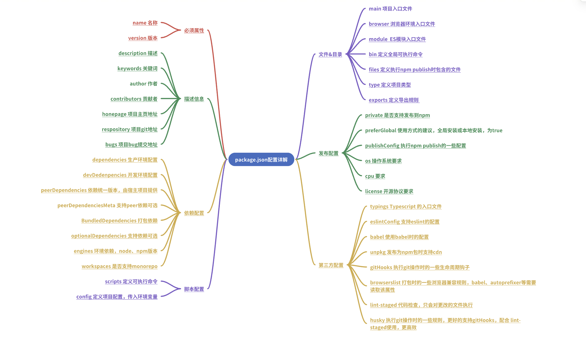

# package.json 详解

## 前言

在目前的前端项目中，package.json 是一个必须的文件，它定义了项目的依赖和构建方式，其中包含了许多字段和选项，这些配置可以影响项目的构建、依赖管理、脚本执行等方面。

对于大部分的前端开发者来说，我们只需要知道 package.json 中的`dependencies`、`devDependencies`、`scripts`就够了，但是对于库开发者或者是脚手架开发人员来说，熟悉并掌握 package.json 中的其他字段来说也是非常重要的。

本文介绍的字段分为官方字段与非官方字段。非官方字段是被主流打包工具（webpack，Rollup）所支持（他们会在打包时读取 package.json 中的响应配置）， 旨在提供更高级的配置和功能，以满足特定的构建需求，可能不具备通用性。

目前版本：**v7.24.2**



## 一、必须属性

当我们在一个项目中执行 `npm init` 时，会自动创建一个 package.json 文件。其中 name 和 version 的属性是必须的，其他的属性都是可选的。

### name

name 属性定义了项目的名称，并且是唯一的，不能使用空格，不能使用特殊字符，只能使用小写字母和连字符（-），并且不能以数字开头。

### version

version 属性定义了项目的版本号，一般来说是由固定的格式：大版本号 ，次版本号，修订号。

1. 大版本号 ： 当项目出现了破坏性的更新，不再兼容就版本时，大版本号会加 1，比如 1.0.0 -> 2.0.0。
2. 次版本号 ： 当项目做了功能更新，并且兼容之前的版本时，次版本号会加 1，比如 1.0.0 -> 1.1.0。
3. 修订号 ： 当项目做了 bug 修复，并且不改变功能时，修订号会加 1，比如 1.0.0 -> 1.0.1。

## 二、 描述信息

### description

定义了项目的简要描述，可以是一段文字，也可以是一个 URL。

### keywords

定义了项目的关键词，是一个数组，可以是多个，用逗号分隔。

### author

项目的作者

### contributors

项目的贡献者

### homepage

项目的主页地址，或者组件库的 playground 地址,可以快速浏览项目

### repository

项目的仓库地址，可以是 git 仓库地址，也可以是 svn 仓库地址

### bugs

项目的 bug 反馈地址，提供给开源项目的参与者提交问题的邮箱地址

## 三、依赖配置

### dependencies

dependencies 是项目的依赖，当项目运行时，依赖的包会一起被安装。该属性下的依赖包存在于打包后的生产环境代码。

### devDependencies

devDependencies 是开发环境下的依赖，当项目运行时，依赖的包不会一起被安装。该属性下的依赖包主要用于构建代码，比如 webpack，gulp 等打包工具，eslint、prettier 等代码检查工具。

### peerDependencies

peerDependencies 是项目的依赖，但是不一定会被安装，指定依赖宿主环境的包。
优点：

1. 可以减少打包体积，比如开发一个依赖 react 的组件库，必须要依赖 react，但是组件库的开发者不需要在项目中安装 react，只需要在 package.json 中声明 peerDependencies，打包后的代码中不会包含 react 的代码，也不会在打包后的代码中包含 react 的依赖包。
2. 版本一致性，使你的组件库的依赖版本与使用者的版本保持一致，避免版本冲突。

示例： 声明使用组件库时，react 的版本要大于 17.0.1

```json
"peerDependencies": {
    "react": ">17.0.1"
  }
```

### peerDependenciesMeta

peerDependenciesMeta 是 peerDependencies 的补充，可以为每个依赖包指定一些元数据，比如是否是可选的，或者是否是必须的。

将 react 设置为可选，用户可以选择不安装 react，npm 不会警告

```json
  "peerDependenciesMeta": {
    "react": {
      "optional": true //标记为可选
    }
  }

```

### bundledDependencies

bundledDependencies 是打包后的代码中包含的依赖包，可以是多个，用逗号分隔。

### optionalDependencies

optionalDependencies 是可选的依赖，当依赖包的安装失败时，不会报错，也不会中断安装。

### engines

engines 是项目运行的环境，声明项目对 node、npm 的版本要求。

```json
  "engines": {
    "node": ">=8.10.3 <12.13.0",
    "npm": ">=6.9.0"
  }

```

npm 目前没有要求，用户安装的版本不符合要求也不影响安装，但使用 pnpm 和 yarn 会导致安装失败。

### workspaces

workspaces 是一个非官方的字段，是用于支持 monorepo 的，monorepo 是一个包含多个项目的仓库，比如一个项目中包含多个库，或者多个应用。在 workspaces 中的 package 会软链到根目录下的 node_modules，这样可以减少重复的依赖。在 workspaces 中的 package 中执行 npm init，就会创建一个 monorepo 子应用。

workspaces 功能与 lerna 类似，如果只需简单地管理多个包，workspaces 足够了。lerna 具有版本管理，发包提示，简化多包项目发布流程等更多功能。

## 脚本配置

### scripts

用来配置可执行命令、脚本

```json
"scripts":{
    "start": "node index.js",
    "build": "webpack --config webpack.config.js"
}
```

### config

定义项目的配置,设置环境变量等

```json
"config":{
    "baseUrl": "http://localhost:8080",
    "port": 8080
}
```

在项目启动时，可以通过 `process.env.npm_package_config_baseUrl` 获取配置的值

## 文件&目录

### main

指定 CommonJS 模块或 ES 模块入口文件。如果不指定该字段，默认是根目录下的 index.js
_提示：从 Node.js 12.20.0 版本开始，"main" 字段也可以指定 ES 模块的入口文件_

```js
"main": "dist/index.js"
"main": "dist/index.esm.js"
```

### module

指定 ES 模块入口文件
示例：当其他开发者在他们的项目中导入你的包时，会加载并执行包中的 dist/index.esm.js

```js
"module": "dist/index.esm.js"
```

### browser

打包为浏览器环境代码时，指定使用的入口文件，如 umd 模块

```js
"browser": "dist/index.umd.js",
```

当一个项目同时定义了 main，browser 和 module，像 webpack，rollup 等构建工具会感知这些字段，并会根据环境以及不同的模块规范来进行不同的入口文件查找。
比如 webpack 构建项目时默认的 target 为 'web'，也就是 Web 构建。它的 resolve.mainFields 字段默认为 ['browser', 'module', 'main']。

```js
module.exports = {
  //...
  resolve: {
    mainFields: ["browser", "module", "main"],
  },
};
```

此时会按照 `browser -> module -> main` 的顺序来查找入口文件。

### bin

定义在全局安装时可执行的命令，例如构建脚手架

```js
{
    "bin":"cli.js"
}
```

### files

指定有哪些文件会被发布到 npm，避免无用文件发布，导致下载时间过长

```json
"files": [
  "filename.js",
  "directory/",
  "glob/*.{js,json}"
 ]
```

一般情况下，files 里会指定构建出来的产物以及类型文件，而 src，test 等目录下的文件是原始代码，一般不需要跟随发布。

### type

在 node 支持 ES 模块后，要求 ES 模块采用 .mjs 后缀文件名。只要遇到 .mjs 文件，就认为它是 ES 模块。如果不想修改文件后缀，就可以在 package.json 文件中，指定 type 字段为 module。

### exports （非官方字段）

可以修改导出规则

```json
"exports": {
  ".": {
    "require": "./index.js",
    "import": "./index.mjs"
  }
}
```

## 发布配置

### private

private 是一个布尔值，表示是否公开项目。默认为 false，表示公开。

### preferGlobal

当设置 "preferGlobal" 字段为 true 时，它表示你的包更适合以全局方式安装，而不是作为项目的依赖项进行本地安装。

这个字段的设置是为了向用户传达关于你的包的最佳使用方式的建议。它并不会直接影响包的安装方式或包管理器的行为。

### publishConfig

发布包时的指定配置
示例：指定包发布的注册表 URL，指定所有用户都可以访问（私有的会收费）

```js
  "publishConfig": {
    "registry": "https://registry.npmjs.org/",
    "access": "public"
  }
```

### os

指定你的包使用的操作系统，可以是多个，用逗号分隔。

### cpu

限制用户安装的 cpu

### license

开源协议

## 第三方配置

### typings

typings 字段用来指定 TypeScript 的入口文件：

```js
"typings": "types/index.d.ts",
```

该字段的作用和 main 配置相同。

### eslintConfig

eslint 的配置可以写在单独的配置文件.eslintrc.json 中，也可以写在 package.json 文件的 eslintConfig 配置项中。

```js
"eslintConfig": {
      "root": true,
      "env": {
        "node": true
      },
      "extends": [
        "plugin:vue/essential",
        "eslint:recommended"
      ],
      "rules": {},
      "parserOptions": {
        "parser": "babel-eslint"
     },
}

```

### babel

babel 用来指定 Babel 的编译配置

```json
"babel": {
    "presets": ["@babel/preset-env"],
    "plugins": []
}
```

### unpkg

使用该字段可以让 npm 上所有的文件都开启 cdn 服务，该 CND 服务由 unpkg 提供：

```json
"unpkg": "dist/vue.js"
```

### lint-staged

lint-staged 是一个在 Git 暂存文件上运行 linters 的工具，配置后每次修改一个文件即可给所有文件执行一次 lint 检查，通常配合 gitHooks 一起使用。

```json
"lint-staged": {
	"*.js": [
  	"eslint --fix",
    "git add"
  ]
}
```

### gitHooks

`gitHooks` 用来定义一个钩子，在提交（commit）之前执行 ESlint 检查。在执行 lint 命令后，会自动修复暂存区的文件。修复之后的文件并不会存储在暂存区，所以需要用 git add 命令将修复后的文件重新加入暂存区。在执行 `pre-commit` 命令之后，如果没有错误，就会执行 git commit 命令：

```json
"gitHooks": {
	"pre-commit": "lint-staged",
}
```

### husky

`husky` 是一个 `Git hooks` 工具，能够在项目中配置 `hooks` 脚本；当我们执行 git 操作时，自动触发配置的脚本；常用的 hooks 有 `pre-commit` 和 `commit-message`。

```json
"Husky":{
    "hooks": {
        "pre-commit": "npm run lint-staged",
    }
}
```

### browserslist

browserslist 字段用来告知支持哪些浏览器及版本。Babel、Autoprefixer 和其他工具会用到它，以将所需的 polyfill 和 fallback 添加到目标浏览器。比如最上面的例子中的该字段值:

```json
"browserslist": {
  "production": [
    ">0.2%",
    "not dead",
    "not op_mini all"
  ],
  "development": [
    "last 1 chrome version",
    "last 1 firefox version",
    "last 1 safari version"
  ]
}
```

## 总结

掌握 `package.json`的每个配置的意义，这对我们来说很重要，因为它们可以影响到我们项目的构建、打包、发布、运行等。
