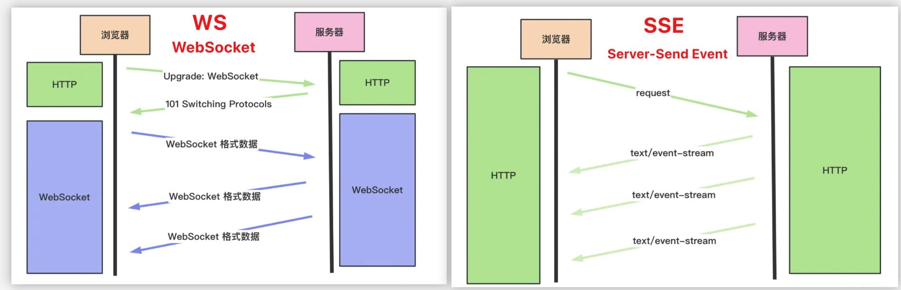

# SSE

## 前言

我們知道在使用 ChatGPT 的時候，答案的呈現形式是一個字一個字打出來的，這樣的流式傳輸，很明顯使用的是服務端推送技術，但並不是用的 websocket，而是另外一种 SSE 技術。

## 什么是 SSE（Server-Sent Events）？

**SSE（Server-Sent Events）** 是一种基于 HTTP 的单向通信协议，允许服务器向浏览器 **持续推送数据**，无需客户端频繁轮询。

它通过浏览器内置的 `EventSource` 对象建立连接，**只从服务器到客户端**单向传输数据，常用于实时日志、行情、消息通知等轻量级实时场景。

## SSE 特点

- 建立在标准 HTTP 协议之上（使用 `text/event-stream`）。
- 客户端通过 `EventSource` 接收服务端推送的消息。
- **只支持服务器 → 客户端单向通信**。
- 自动重连机制，连接断开后自动尝试重连。
- 天然支持 HTTP 缓存、代理、安全策略。

### 🌐 客户端代码示例

```js
const evtSource = new EventSource('/sse');

evtSource.onmessage = (event) => {
	console.log('Message from server:', event.data);
};

evtSource.onerror = () => {
	console.error('SSE connection error.');
};
```

---

## 🔄 SSE vs WebSocket 对比

| 特性              | SSE                            | WebSocket                         |
| ----------------- | ------------------------------ | --------------------------------- |
| 通信方式          | 单向（服务器 → 客户端）        | 双向（客户端 ↔ 服务器）           |
| 协议              | HTTP（`text/event-stream`）    | 自定义 WebSocket 协议（ws / wss） |
| 建立连接          | 简单（直接基于 HTTP）          | 需握手升级为 WebSocket            |
| 客户端支持        | 所有现代浏览器                 | 所有现代浏览器                    |
| 重连机制          | 内置自动重连                   | 需手动处理                        |
| 消息格式          | 文本流，标准格式               | 自由格式（二进制、JSON、文本）    |
| 压力处理/并发性能 | 较适合轻量推送                 | 更适合高频、复杂的实时交互        |
| 安全性/中间件支持 | 完美兼容 HTTP 代理、防火墙     | 部分代理需额外配置                |
| 使用场景          | 日志流、通知、行情、状态更新等 | 聊天系统、在线游戏、协作编辑等    |

---

## ✅ SSE 适合场景

- 新闻更新/股票推送
- 服务端日志实时显示
- 异步任务状态通知
- IoT 数据实时展示

---

## ❌ SSE 不适合的情况

- 需要 **双向通信** 的应用（比如：聊天、WebRTC 信令）
- 服务端数据量大且频繁
- 客户端为非浏览器环境（需额外 polyfill）

## 🔚 总结

| 技术          | 优点                           | 缺点                      |
| ------------- | ------------------------------ | ------------------------- |
| **SSE**       | 简单、轻量、内置重连、安全性好 | 单向通信、不支持二进制    |
| **WebSocket** | 双向通信、支持高并发和二进制   | 实现复杂、需管理连接/心跳 |

> 🧠 **选择建议**：
>
> - 如果你只需要从服务器推送数据到客户端，并且不想引入复杂通信逻辑 —— 用 **SSE**。
> - 如果你需要双向交互、频繁消息传输或需要发送二进制数据 —— 用 **WebSocket**。


