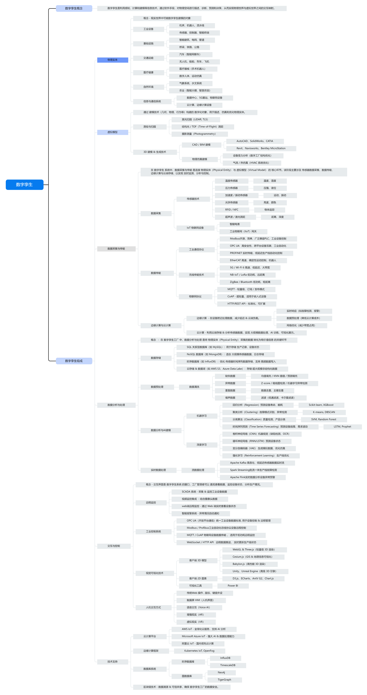

# 数字孪生

本篇文章旨在整体介绍`数字孪生概念`及`相关技术栈`，注重`知识广度`。

## 什么是数字孪生？

当我们提到数字孪生时，很多人的第一反应就是“哇，超酷的 3D 画面！” ，确实，现在很多人一听到这个词，脑海里立刻浮现出那些精美的 3D 模型和虚拟现实场景。但其实，只有 3D 可视化并不能等同于数字孪生，3D 展示只是它的一个外在表现，是整个数字孪生生态系统的一部分而已。

**数字孪生概念**

> 数字孪生是利用感知、计算和建模等信息技术，通过软件手段，对物理空间进行描述、诊断、预测和决策，从而实现物理世界与虚拟世界之间的交互映射。

换句话说，就是把现实中的实体，通过一系列技术“映射”到虚拟空间中，目的是为了达到更高层次的监控、控制和模拟效果。

**完整映射物理世界**

- 利用数字仿真技术建立一个虚拟模型，实时反映现实中设备或环境的状态。
- 通过信息传输、数据分析、双向控制和环境模拟，实现对物理设备的监控、调控和行为预测。

**结合 AI 数据分析**

- 利用 AI 模型来预测故障、优化生产流程，从而实现更智能的决策支持。

3D 模型 只是数字孪生的“前端表现层”，真正的价值在于数据处理和决策支持。

## 数字孪生实现的六大组成部分

数字孪生的完整实现需要结合以下六个方面：
| 组成部分 | 主要作用 |
| ----------------------------------------------------- | ------------------------------------------------------------------------------------------------------------------------------------------- |
| **物理实体（Physical Entity）** | 提供真实存在的物体、系统或过程，是数据采集的源头。传感器部署于物理实体上，实时采集温度、压力、振动等数据，为虚拟模型提供输入。 |
| **虚拟模型（Virtual Model）** | 构建与物理实体高度相似的数字化模型，通过仿真模拟其行为，实现实时映射、预测分析和参数优化，为决策提供支持。 |
| **数据采集与传输（Data Acquisition & Transmission）** | 利用传感器、IoT 设备和通信网络（如 5G、Wi-Fi、工业以太网）实时采集和传输物理实体数据，确保数据在物理和虚拟世界之间的高效、稳定交换。 |
| **数据分析与处理（Data Analysis & Processing）** | 使用 AI、机器学习和大数据技术对采集的数据进行清洗、存储和处理，从中提取有价值信息，进行故障预测、能耗优化和生产流程仿真，提升决策的准确性。 |
| **交互与控制（Human-Machine Interface & Control）** | 通过可视化界面（如 3D 模型、图形仪表）实现用户与系统的交互，同时提供远程监控、参数调整和设备控制的功能，使用户能够直观管理物理实体。 |
| **技术支撑（Enabling Technologies & Platforms）** | 提供高性能数据库、数字孪生引擎（如 Unity、Three JS、Unreal Engine）等底层支撑，确保系统具备强大的计算、存储能力和高保真可视化效果。 |

## 各组成部分的关键技术

数字孪生系统通过各模块间的协同工作，实现了对物理实体的全面数字化映射与动态模拟。下面详细介绍各模块的实现技术及其关键应用。

### 物理实体与传感器技术

**传感器与设备监测**

- 温度、湿度、压力、振动、光照等多种传感器实时采集数据。

**智能设备与 PLC**

- 采用可编程逻辑控制器（PLC）及工业自动化设备，实现现场数据采集与初步控制。

### 虚拟模型构建

**3D 建模与渲染**

- **几何建模**（Geometry Modeling）：使用多边形网格、NURBS 曲面等表示物体形态。
- **渲染**（Rendering）：通过光照、阴影、材质等技术生成真实感图像。
- **物理引擎**（Physics Engine）：模拟重力、碰撞等物理特性。
- **交互控制**：使用鼠标、手柄、VR 设备等进行操作。

使用 CAD/BIM 工具生成工厂和设备的 3D 模型；通过 Unity、Unreal Engine 或基于 WebGL 的 Three.js 展现实时虚拟场景。

**虚拟现实（VR）/增强现实（AR）**

- 应用 HTC Vive、Microsoft HoloLens 等设备，实现沉浸式虚拟巡检和远程维修指导。

**实时仿真**

- 基于物理仿真（如常微分方程或多体动力学），实时反映设备运行状态和工艺流程变化，辅助故障预警和流程优化。

### 数据采集与传输

**传感器技术**

- **传感器类型**
  - 包括温度传感器（热电偶）、压力传感器（MEMS）、位置传感器（GPS、RFID）、振动传感器（加速度计）等。
- **物联网（IoT）设备**
  - 例如智能电表、工业物联网（IIoT）网关，支持数据的实时采集。

**通信技术**

- **协议**
  - 采用 5G、NB-IoT（低功耗广域网）、Wi-Fi、蓝牙等用于设备连接；以及 MQTT、CoAP、OPC UA 等工业数据传输协议。
- **边缘计算**
  - 在设备端或边缘节点进行数据预处理，减轻云端负载，如在工厂车间部署边缘服务器。

### 数据分析与处理

**大数据平台**

- 使用 Apache Kafka、Spark 等技术对工厂产生的海量数据进行实时流处理和分布式计算。

**人工智能与机器学习**

- 利用 TensorFlow、PyTorch 等框架构建预测性维护模型，检测设备异常并优化能耗。

**时序数据库**

- InfluxDB、TimescaleDB 用于存储传感器时间序列数据，支持趋势分析与历史对比。

### 交互与控制

虚拟实体与物理实体之间的关联

**SCADA 系统**

- 集成监控、数据采集与控制功能，实现对整个工厂的实时远程监控和自动化控制。

**人机界面**

- 基于 web 浏览器技术，构建直观的监控仪表板和控制面板，支持实时查看状态、告警信息和参数调整。

**工业控制协议**

- 通过 Modbus、Profibus 等协议，实现数字孪生系统与现场设备之间的双向数据交互和控制指令下发

### 技术支撑

**云计算平台**

- 如 AWS IoT、Microsoft Azure IoT、阿里云 IoT 平台，提供弹性计算和大规模数据存储能力。

**边缘计算框架**

- 采用 Kubernetes IoT、OpenFog 等标准，在现场实现低延迟、分布式数据处理。

**数据库系统**

- 除了时序数据库（InfluxDB、TimescaleDB）外，还可采用关系型数据库（PostgreSQL）或 NoSQL 数据库（MongoDB）存储辅助数据。

## 数字孪生的应用场景及具体案例

### **智能制造与工业**

#### **案例：西门子数字孪生工厂**

西门子在其**Amberg 工厂**部署了数字孪生系统，对整个生产流程进行实时监控和优化：

- 通过**IoT 设备**和**工业传感器**收集生产数据，实现产品全生命周期监控。
- 结合**AI 和数据分析**，预测设备故障并优化生产参数，提高生产效率。
- 结果：工厂的自动化率达到 75%，生产质量缺陷率低于 0.001%。

#### **案例：波音飞机制造**

波音使用数字孪生技术来优化飞机生产：

- 采用**3D 建模**和**仿真技术**，优化飞机装配流程，减少误差和时间浪费。
- 通过**物联网传感器**采集机身数据，检测潜在缺陷，提高质量控制水平。
- 结果：飞机装配效率提升 30%，维护成本大幅下降。

### **智慧城市与基础设施管理**

#### **案例：新加坡“数字孪生城市”**

新加坡政府构建了完整的数字孪生城市，名为 **Virtual Singapore**：

- 采用**3D GIS 地理信息系统**，实时监控建筑、交通、环境变化。
- 通过**AI 预测算法**，优化交通流量，减少拥堵，提高通勤效率。
- 结果：智慧交通系统减少了 20% 的交通拥堵，提高公共资源利用率。

#### **案例：伦敦泰晤士水务**

伦敦泰晤士水务公司使用数字孪生技术进行水管道管理：

- 在水管上部署**智能传感器**，实时监测水流和压力，防止泄漏。
- 通过**AI 分析历史数据**，预测管道可能发生故障的位置，提前维护。
- 结果：漏水率减少 15%，维护成本降低 10%。

### **航空航天与交通运输**

#### **案例：通用电气（GE）发动机监测**

GE 为其飞机发动机创建数字孪生模型：

- 每个发动机配备**上百个传感器**，实时收集温度、振动、油耗等数据。
- 通过**云计算和 AI 预测**发动机的健康状况，提前进行维护。
- 结果：航班延误减少 10%，维护成本下降 20%。

#### **案例：Tesla 自动驾驶仿真**

特斯拉使用数字孪生技术来训练其自动驾驶系统：

- 创建**虚拟道路环境**，模拟数百万公里的驾驶数据，优化 AI 算法。
- 结合**真实车辆数据**进行对比，优化自动驾驶策略，提高安全性。
- 结果：自动驾驶软件每次更新都变得更加智能，提高行车安全。

### **医疗健康**

#### **案例：心脏数字孪生**

法国 Dassault Systèmes 公司开发了**虚拟心脏模型**，用于心脏疾病研究：

- 采集患者心脏的 MRI、CT 数据，创建个性化 3D 数字心脏。
- 通过**仿真模拟**测试不同的治疗方案，选择最优治疗方式。
- 结果：医生可提前预测手术风险，提高治疗成功率。

#### **案例：COVID-19 疫情预测**

IBM Watson 使用数字孪生技术来模拟 COVID-19 传播：

- 结合全球实时疫情数据，构建**疫情传播仿真模型**。
- 通过 AI 预测不同防疫措施的效果，帮助政府优化防控政策。
- 结果：多国政府根据预测调整防疫策略，提高防控效率。

### **能源与电力**

#### **案例：国家电网数字孪生系统**

国家电网采用数字孪生技术优化电网管理：

- 通过**智能传感器**监控电力设备状态，实现远程管理。
- 使用**AI 预测算法**分析电力需求，优化能源调度。
- 结果：减少 20% 的电力损耗，提高供电稳定性。

#### **案例：风力发电预测与优化**

维斯塔斯（Vestas）风电公司使用数字孪生优化风力发电：

- 采集**风速、温度、湿度等数据**，创建风力发电机的数字孪生模型。
- 通过**AI 预测风力变化**，调整风机角度，提高发电效率。
- 结果：风力发电效率提升 10%，维护成本降低 15%。

### **建筑与工程管理**

#### **案例：迪拜智慧建筑**

迪拜的 Burj Khalifa（哈利法塔）使用数字孪生进行智能维护：

- 通过**物联网传感器**监测建筑温度、湿度、电梯运行状态等。
- 结合**数字仿真**分析建筑结构稳定性，提前预警可能的问题。
- 结果：建筑维护成本降低 25%，提高了建筑的安全性和使用寿命。

#### **案例：地铁隧道施工仿真**

中国铁路建设公司使用数字孪生优化地铁隧道施工：

- 通过**BIM 建筑信息模型**，提前模拟隧道施工过程，优化施工方案。
- 结合**AI 预测地质变化**，降低塌方等安全风险。
- 结果：施工效率提升 15%，减少施工事故风险。

#### 最大价值

1. 工厂设备实时状态监测，及时预警、故障定位、AI 调控。
2. **虚拟测试**：，在产线搭建之前使用数字孪生搭建产线模型，动态调整参数，对比各参数配置下的生产效率，找到最优解。

## 3D 相对于 2D 的优势

在数字孪生 中，3D 技术相较于 2D 具有诸多优势，主要体现在**信息表达、交互体验、精确度**等方面。以下是 3D 相对于 2D 的主要优势：

### **信息表达更加直观**

- **真实感更强**：3D 能够逼真地还原物体的外观、尺寸、比例、光影等，使观察者更容易理解复杂的空间关系。例如，在数字孪生工厂中，3D 模型可以直观展示生产线布局，而 2D 只能用平面图表示。
- **空间感增强**：3D 允许在不同角度观察物体，而 2D 只能从固定视角查看，限制了信息表达。例如，在建筑设计中，3D 设计可以直观展现楼层、空间布局，而 2D 只能提供俯视图或剖面图。

### **增强交互体验**

- **支持旋转、缩放、漫游**：3D 允许用户自由调整视角，查看模型的各个角度，而 2D 只能进行平面移动和缩放，交互方式较为有限。
- **沉浸式体验**：结合 **VR（虚拟现实）/AR（增强现实）**，3D 可以为用户提供沉浸式的体验，例如：
  - 在虚拟工厂中，工程师可以通过 VR 设备“走进”生产线，检查设备状态。
  - 在房地产行业，购房者可以通过 3D 建模提前“参观”未建成的房屋，而不是仅凭 2D 平面图想象。

### **精确度更高，支持仿真分析**

- **支持物理仿真**：3D 模型可以进行真实世界的物理仿真，例如：
  - 在制造业中，3D 模型可以用于**结构力学分析**，预测材料受力情况，而 2D 无法做到。
  - 在航空航天领域，3D 可以模拟空气动力学、温度场等复杂因素，进行飞行仿真。
- **更精准的尺寸控制**：3D 建模软件（如 CAD、SolidWorks）可以进行精准测量，保证设计符合制造要求，而 2D 只能进行平面标注。

### **适用于更复杂的应用场景**

- **工程设计**：在机械、建筑、电子等行业，3D 设计更符合实际制造需求。例如：
  - 在 PCB 设计中，3D 视图可以检查元器件高度、干涉问题，而 2D 只能查看平面布置。
  - 在建筑行业，BIM（建筑信息模型）利用 3D 技术可以更准确地模拟施工过程，避免设计缺陷。
- **医学领域**：
  - 3D 医学影像（CT、MRI）可以重建器官的三维结构，帮助医生进行更精准的诊断和手术规划，而 2D X 光片的可读性较低。
  - 3D 打印可以制作精准的医学植入物，如个性化的假肢、牙科植入物。

### **提高生产效率**

- **减少设计迭代成本**：3D 设计可以提前模拟真实效果，减少设计错误。例如，在汽车制造中，工程师可以在 3D 数字孪生环境中测试新车型，优化结构设计，而不必制作多个实体模型。
- **提升培训和教学效率**：
  - 在工业培训中，使用 3D 数字孪生可以让新员工在虚拟环境中学习操作流程，而不必直接接触昂贵或危险的设备。
  - 在医学教育中，3D 解剖模型比 2D 解剖图更直观，让学生更容易理解人体结构。

| 维度         | 3D 优势                        | 对比 2D                      |
| ------------ | ------------------------------ | ---------------------------- |
| **信息表达** | 真实感强，直观展现空间关系     | 只能用平面图表达，缺乏深度感 |
| **交互体验** | 可旋转、缩放、漫游，支持 VR/AR | 交互方式有限，视角固定       |
| **精确度**   | 可用于仿真、精确测量           | 仅适用于简单标注             |
| **适用场景** | 工业、医学、建筑等多领域       | 适用于简单设计或信息展示     |
| **生产效率** | 提前模拟真实效果，减少迭代成本 | 设计变更成本较高             |

虽然 3D 在很多方面优于 2D，但 2D 仍然有其价值，特别是在简单的 UI 设计、数据可视化（如饼图、柱状图）以及某些场景（如电子电路原理图）中更高效。因此，具体选择 2D 还是 3D 需要根据应用场景来决定。

## 总结

- **第一印象**：很多人将数字孪生简单等同于酷炫的 3D 效果，但这只是表象
- **真正的数字孪生**：基于数字仿真技术，完整映射物理世界，并通过数据传输、处理、分析实现双向控制和环境模拟
- **实现路径**：结合 3D 建模、数据采集与传输、数据处理与分析、3D 可视化、业务应用与控制这五大组成部分，形成一个完整的系统
- **未来发展**：随着 AI、5G、边缘计算等新技术的发展，数字孪生将更加智能化、实时化

> **结语**：数字孪生不仅仅是华丽的 3D 展示，而是一套系统的、基于数据驱动的仿真与控制技术。只有将各个组成部分有机结合，才能真正发挥出数字孪生在节能、降耗、效率提升等方面的巨大潜力。

