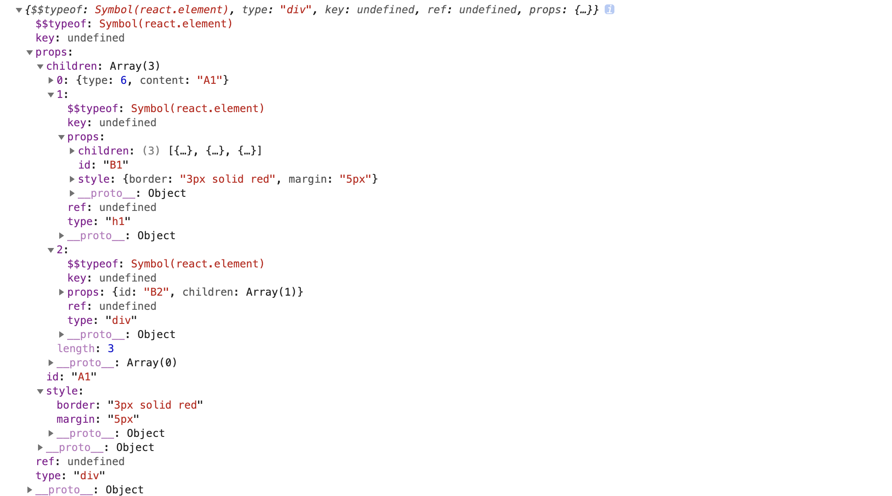

# JSX

JSX 是 React 提供的语法糖，用来代替频繁调用 createElement 方法，看起来简洁明了，通过 babel 编译后就变成了 createElement 方法。

```js
// 样式
style = { border: "3px solid red", margin: 5 };
// jsx 编译之前
let element = (
  <div id="A1" style={style}>
    A1
    <h1 id="B1" style={style}>
      B1
      <h2 id="C1" style={style}>
        C1
      </h2>
      <h3 id="C2" style={style}>
        <span>123</span>
      </h3>
    </h1>
    <div id="B2">B2</div>
  </div>
);

console.log(element);
// 编译之后
element = React.createElement(
  "div",
  { id: "A1", style: style },
  "A1",
  React.createElement(
    "h1",
    { id: "B1", style: style },
    "B1",
    React.createElement("h2", { id: "C1", style: style }, "C1"),
    React.createElement(
      "h3",
      { id: "C2", style: style },
      React.createElement("span", null, "123")
    )
  ),
  React.createElement("div", { id: "B2" }, "B2")
);
```

生成的 ReactElement

React 根据这个数据结构生成对应的 Fiber 树，渲染成真实的 DOM，插入到根节点上。
