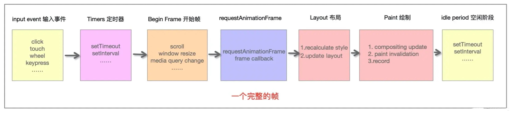
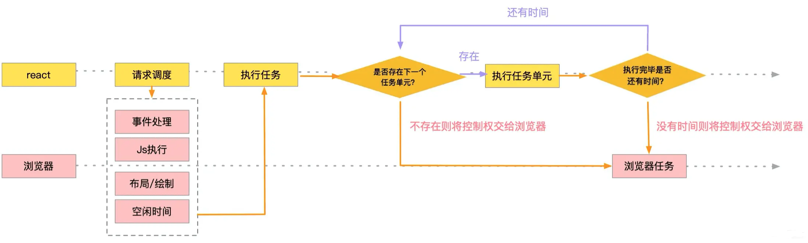
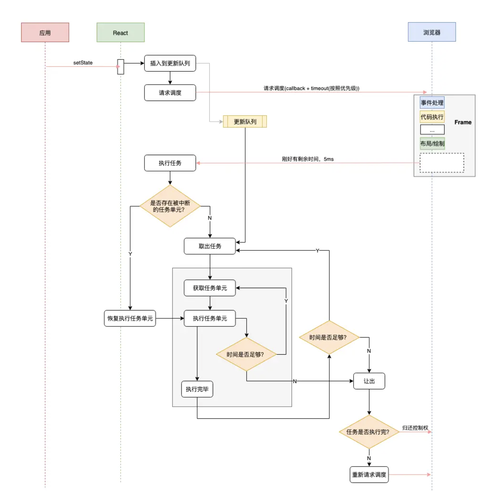
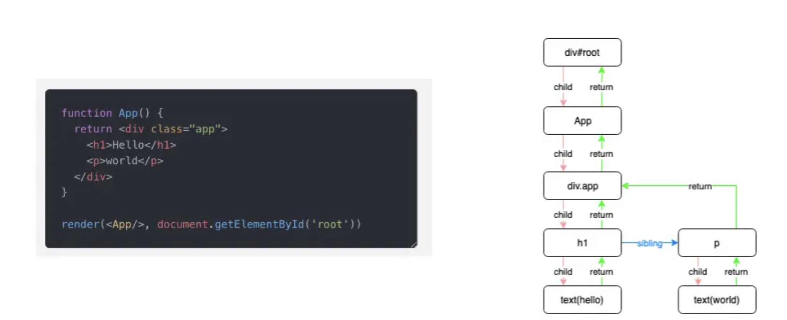

# ReactFiber

`Fiber 数据结构` + `算法` = `Fiber架构`。

## 为什么要有 Fiber

javascript 引擎是在**单线程**运行的。严格来讲，**js 引擎和页面渲染引擎在同一个渲染线程， GUI 渲染和 JS 执行是互斥的。**  
**React V15 在更新时，会递归对比 VirtualDOM 树，找出需要变动的节点，然后同步更新它们，一气呵成。这个过程在 React 中被称为 Reconciliation (协调)**，协调 是一个很耗时的 CPU 密集型操作，在协调期间，React 会一直占用 CPU 资源，导致以下问题：

1. 用户触发的事件得不到响应
2. GUI 渲染延迟，导致页面掉帧，用户感觉页面卡顿。

因此 React 团队在 V16 版本中引入了 `Fiber 架构`， 通过 `Fiber 架构` ，将 `Reconciliation` 过程 变为**可被中断**。‘适时’的让出 CPU 执行权，除了让浏览器及时的响应用户的交互，还有其它好处：

1. 与其一次性操作大量 DOM 节点相比, 分批延时对 DOM 进行操作，可以得到更好的用户体验。
2. 给浏览器一点喘息的机会，他会对代码进行编译优化（JIT）及进行热代码优化，或者对 reflow 进行修正.

## 何为 Fiber

对于 React 来讲，Fiber 可以从两个角度理解：

### 1. 一种流程控制语句

Fiber 也称为 `协程`,与线程不同，是一种控制流程的让出机制。类似于 `Generator` 函数：

普通的函数在执行过程中 不能被**中断和恢复**：

```js
const tasks = [];
function run() {
  let task;
  while ((task = tasks.shift())) {
    execute(task);
  }
}
```

而 `Generator`可以：

```js
const tasks = [];
function* run() {
  let task;
  while ((task = tasks.shift())) {
    // 判断是否有高优先级事件需要处理, 有的话让出控制权
    if (hasHighPriorityEvent()) {
      yield;
    }

    // 处理完高优先级事件后，恢复函数调用栈，继续执行...
    execute(task);
  }
}
```

React Fiber 的思想和 协程的概念是相契合的：**React 渲染的过程可以被中断，可以将控制权交回给浏览器，让位给高优先级的任务，浏览器空闲后再恢复渲染。**

1. React Fiber 采用了主动让出机制。
2. 通过 requestIdleCallback API 来决定是否交出控制权。`requestIdleCallback` 的意思是指**让浏览器有空的时候就执行我们的回调，这个回调会传入一个期限，表示浏览器有多少时间供我们执行，为了不耽误事，我们最好在这个时间范围内执行完毕**

一般情况下浏览器的刷新频率是 60HZ，那么一帧的时间就是大约 16ms。浏览器在一帧内会做哪些事情：



1. 处理用户输入事件。
2. javascript 执行。
3. requestAnimationFrame 调用。
4. 布局 Layout。
5. 绘制 Point。
6. requestIdleCallback （是否剩余时间）

如果浏览器处理完上述事情之后还有剩余的时间，那么浏览器就会调用 `requestIdleCallback`回调。

**但是在浏览器繁忙的时候，可能不会有盈余时间，这时候 `requestIdleCallback` 回调可能就不会被执行。 为了避免饿死，可以通过 `requestIdleCallback` 的第二个参数指定一个超时时间。**

#### 任务优先级

为了避免任务被饿死，可以设置一个超时时间. **这个超时时间不是死的，低优先级的可以慢慢等待, 高优先级的任务应该率先被执行**. 目前 React 预定义了 5 个优先级:

- Immediate(-1) - 这个优先级的任务会**同步执行**, 或者说要**马上执行且不能中断**
- UserBlocking(250ms) 这些任务一般是用户交互的结果, **需要即时得到反馈**
- Normal (5s) 应对哪些**不需要立即感受到的任务，例如网络请求**
- Low (10s) **这些任务可以放后，但是最终应该得到执行**. 例如分析通知
- Idle (没有超时时间) 一些没有必要做的任务 (e.g. 比如隐藏的内容), 可能会被饿死

### 2. 一个执行单元

Fiber 的另外一种解读是’纤维‘: 这是一种数据结构或者说执行单元。将它视作一个执行单元，每次执行完一个'执行单元', React 就会检查现在还剩多少时间，如果没有时间就将控制权让出去.交互流程如下：



假设用户调用 `setState` 更新组建，这个带更新的任务会先放入队列中，然后通过 `requestIdleCallback`请求浏览器调度。

```js
updateQueue.push(updateTask);
requestIdleCallback(performWork, { timeout });
```

现在浏览器有空闲或者超时了，就会调用 `performWork` 来执行任务：

```js
// 1️⃣ performWork 会拿到一个Deadline，表示剩余时间
function performWork(deadline) {
  // 2️⃣ 循环取出updateQueue中的任务
  while (updateQueue.length > 0 && deadline.timeRemaining() > ENOUGH_TIME) {
    workLoop(deadline);
  }

  // 3️⃣ 如果在本次执行中，未能将所有任务执行完毕，那就再请求浏览器调度
  if (updateQueue.length > 0) {
    requestIdleCallback(performWork);
  }
}
```

`workLoop` 的工作大概猜到了，他就是从 更新队列中 获取更新任务来执行，每执行完一个`执行单元`，就检查一下剩余时间是否充足，如果充足就继续执行下一个`执行单元`，否则就交出控制权，保存现场，并请求下一次执行权限：

```typescript
// 保存当前的处理现场
let nextUnitOfWork: Fiber | undefined; // 保存下一个需要处理的工作单元
let topWork: Fiber | undefined; // 保存第一个工作单元

function workLoop(deadline: IdleDeadline) {
  // updateQueue中获取下一个或者恢复上一次中断的执行单元
  if (nextUnitOfWork == null) {
    nextUnitOfWork = topWork = getNextUnitOfWork();
  }

  // 🔴 每执行完一个执行单元，检查一次剩余时间
  // 如果被中断，下一次执行还是从 nextUnitOfWork 开始处理
  while (nextUnitOfWork && deadline.timeRemaining() > ENOUGH_TIME) {
    // 下文我们再看performUnitOfWork
    nextUnitOfWork = performUnitOfWork(nextUnitOfWork, topWork);
  }

  // 提交工作，下文会介绍
  if (pendingCommit) {
    commitAllWork(pendingCommit);
  }
}
```

流程图如下：



### 3. 数据结构

为了配合 `Reconciliation` 的可中断和可恢复操作。Fiber 采用了 `单向链表`， **每个 VirtualDOM 节点内部现在使用 `Fiber` 表示**，结构如下：

```js
export type Fiber = {
  // Fiber 类型信息
  type: any,
  // ...

  // ⚛️ 链表结构
  // 指向父节点，或者render该节点的组件
  return: Fiber | null,
  // 指向第一个子节点
  child: Fiber | null,
  // 指向下一个兄弟节点
  sibling: Fiber | null,
};
```

用图片展示这个关系：



有了这个数据结构调整，现在可以以迭代的方式来处理这些节点了。来看看 `performUnitOfWork` (执行工作单元) 的实现, 它其实就是一个深度优先的遍历：

```js
/**
 * @params fiber 当前需要处理的节点
 * @params topWork 本次更新的根节点
 *
 * 执行一个fiber，返回下一个fiber
 */
function performUnitOfWork(fiber: Fiber, topWork: Fiber) {
  // 对该节点进行处理
  beginWork(fiber);

  // 如果存在子节点，那么下一个待处理的就是子节点
  if (fiber.child) {
    return fiber.child;
  }

  // 没有子节点了，上溯查找兄弟节点
  let temp = fiber;
  while (temp) {
    completeWork(temp);

    // 到顶层节点了, 退出
    if (temp === topWork) {
      break;
    }

    // 找到，下一个要处理的就是兄弟节点
    if (temp.sibling) {
      return temp.sibling;
    }

    // 没有, 继续上溯
    temp = temp.return;
  }
}
```

你可以配合上文的 `workLoop` 一起看，Fiber 就是我们所说的工作单元，`performUnitOfWork` 负责对 `Fiber` 进行操作，并按照深度遍历的顺序返回下一个 `Fiber`.

因为使用了链表结构，即使处理流程被中断了，我们随时可以从上次未处理完的 `Fiber` 继续遍历下去。

## Fiber 执行原理

从根节点开始渲染和调度的过程可以分为两个阶段：render 阶段、commit 阶段。

- render 阶段： 这个阶段是可中断的，会找出所有节点的变更。
- commit 阶段：这个阶段是不可中断的，会执行所有的变更。

**还需要了解以下几个名词：**

1. `RootFiber` 不是 Fiber， 但有一个 current 属性指向 `workInProgress`
2. `currentFiber 树` 首次渲染之后，React 会生成一个对应于 UI 渲染的 fiber 树，称之为 current 树。在新一轮更新时 workInProgress tree 再重新构建，新 workInProgress 的节点通过 alternate 属性和 currentFiber 的节点建立联系。
3. `WorkInProgress 树` 代表当前正在执行更新的 Fiber 树。setState 后会生成新的 WorkInProgress。 每一个节点保存的都是新的 fiber 节点。
4. `Effect List` 可以理解为是一个存储 effect 副作用列表容器.

**currentFiber 和 WorkInProgress 双缓存技术， 减少内存分配和 gc。**

### render 协调阶段

此阶段会找出所有节点的变更，如节点新增、删除、属性变更等，这些变更被 react 统称为 `副作用（Effect`），此阶段会构建一棵新的 fiber tree ，即 `workInProgress` 树，以虚拟节点为维度对任务进行拆分，即一个`虚拟DOM节点`对应一个`任务`。最后产出的结果是 `effect list`,从中可以知道那些节点更新、增加、删除。

#### 生命周期

render 阶段的生命周期：

- getDerivedStateFromProps
- shouldComponentUpdate
- render

#### 遍历流程

`React Fiber` 首先将 虚拟 DOM 转化为 `Fiber tree`, 因此每个节点都有 `child` 、`sibling` 、`return`

**遍历 Fiber tree 时采用的是后序遍历方法:**

- 从顶部开始遍历
- 如果有 child 节点，且还未遍历，遍历 child 节点
- 如果没有 child 节点，返回父节点
- 如果有 child 节点，且已经遍历过，则遍历 sibling 节点。
- 如果最后返回的节点为顶部，表示所有节点遍历完成。

每个 Fiber 上都有个 `alternate` 属性,指向一个 current Fiber 树 的 fiber,创建 `WorkInProgress` 节点时优先取 `alternate`,没有的话就创建一个。

#### 收集 effect list

### commit 提交阶段

这个阶段是同步的，一气呵成，不会被中断。 根据 `effect list` 去更新试图。

#### 生命周期

- getSnapshotBeforeUpdate
- componentDidMount
- componentDidUpdate
- componentWillUnmount

  由于这些方法在提交阶段被调用，因此它们可能包含任何副作用和 DOM 操作。
