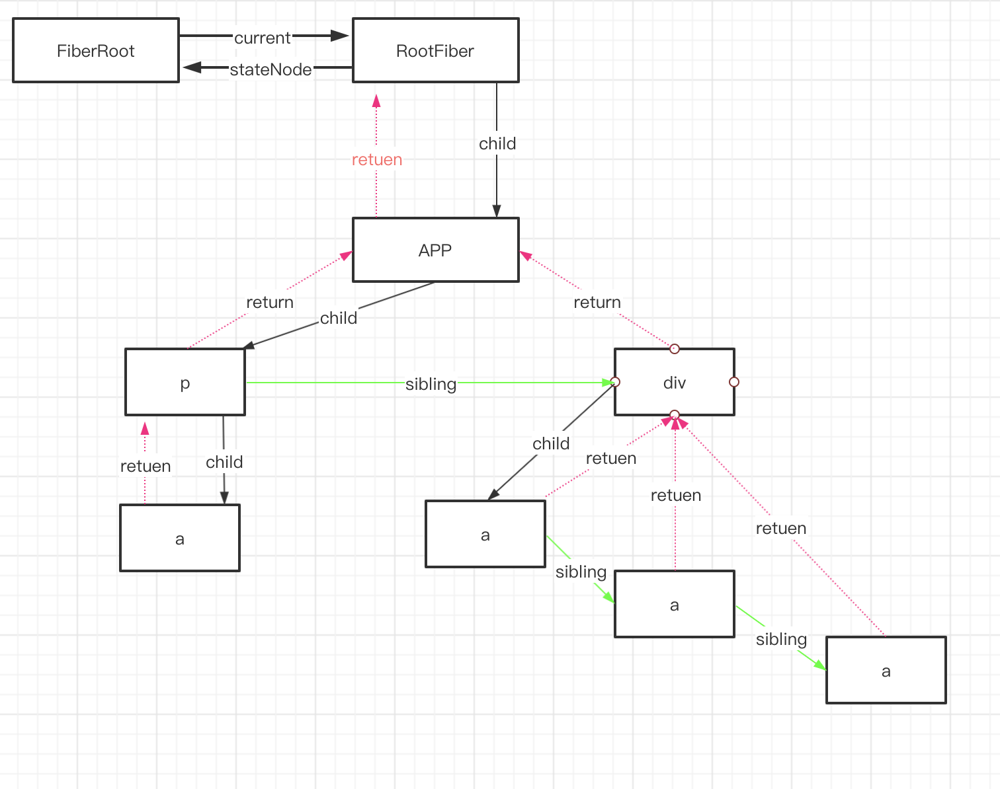

# Fiber 数据结构

## RootType

**render** 中创建 **ReactRoot**的时候**legacyCreateRootFromDOMContainer** 方法返回的。

```js
type RootType = {
  render(children: ReactNodeList): void,
  unmount(): void,
  _internalRoot: FiberRoot, // 这个是主要的
  ...
};
```

## FiberRoot

在 **render** 的时候创建 **ReactRoot** 的同时创建 **FiberRoot** 和 **Fiber**

```js
function FiberRootNode(containerInfo, tag, hydrate) {
  // root 类型 有legacy,batched,concurrent 分别对应 0｜1｜2
  this.tag = tag;
  // 当前应用对应的Fiber对象,是一个可变根的 树
  this.current = null;
  // root节点, render 方法接受的第二个参数 ，DOM元素
  this.containerInfo = containerInfo;
  // 只有在持久更新中用到,一般用不到
  this.pendingChildren = null;
  this.pingCache = null;
  // 完成的过期时间
  this.finishedExpirationTime = NoWork;
  // 已完成的正在进行的 HostRoot 已准备好提交
  this.finishedWork = null;
  // setTimeout 返回的超时句柄。用于取消挂起的超时（如果它被新的超时取代）。
  this.timeoutHandle = noTimeout;
  // 顶部上下文对象，由 renderSubtreeIntoContainer 使用
  this.context = null;
  this.pendingContext = null;
  // 用来确定第一次渲染的时候是否需要融合
  this.hydrate = hydrate;
  // 调用 Scheduler.scheduleCallback返回的节点
  this.callbackNode = null;
  // 与 root 相关联的回调优先级
  this.callbackPriority = NoPriority;
  // 树中存着的最早的过期时间
  this.firstPendingTime = NoWork;
  // 树中存着的最早的暂停过期时间
  this.firstSuspendedTime = NoWork;
  // 树中存着的最新暂停过期时间
  this.lastSuspendedTime = NoWork;
  // 暂停范围后的下一个已知到期时间
  this.nextKnownPendingLevel = NoWork;
  // 再次渲染的最新时间
  this.lastPingedTime = NoWork;
  // 	再次渲染的过期时间
  this.lastExpiredTime = NoWork;

  if (enableSchedulerTracing) {
    this.interactionThreadID = unstable_getThreadID();
    this.memoizedInteractions = new Set();
    this.pendingInteractionMap = new Map();
  }
  if (enableSuspenseCallback) {
    this.hydrationCallbacks = null;
  }
}
```

## FiberNode

在创建 **rootFiber** 调用了 **createHostRootFiber**,这个方法内部实际调用了 **createFiber** 返回一个 Fiber 对象

```js
// Fiber对应一个组件需要被处理或者已经处理了，一个组件可以有一个或者多个Fiber
type Fiber = {
  // 标记不同的组件类型
  tag: WorkTag,
  // ReactElement里面的key
  key: null | string,
  // ReactElement.type，也就是我们调用`createElement`的第一个参数
  elementType: any,
  // 异步组件resolved之后返回的内容，一般是`function`或者`class`
  type: any,
  // 跟当前Fiber相关本地状态（比如浏览器环境就是DOM节点）
  stateNode: any,

  // ======Fiber链表=========
  // 指向他在Fiber节点树中的`parent`，用来在处理完这个节点之后向上返回
  return: Fiber | null,
  // 指向自己的第一个子节点
  child: Fiber | null,
  // 指向自己的兄弟结构 ，兄弟节点的return指向同一个父节点
  sibling: Fiber | null,
  index: number,

  // ref属性
  ref: null | (((handle: mixed) => void) & { _stringRef: ?string }) | RefObject,
  // 新的变动带来的新的props
  pendingProps: any,
  // 上一次渲染完成之后的props
  memoizedProps: any,
  // 该Fiber对应的组件产生的Update会存放在这个队列里面
  updateQueue: UpdateQueue<any> | null,
  // 上一次渲染的时候的state
  memoizedState: any,
  // 一个列表，存放这个Fiber依赖的context
  firstContextDependency: ContextDependency<mixed> | null,
  // 用来描述当前Fiber和他子树的`Bitfield`
  // 共存的模式表示这个子树是否默认是异步渲染的
  // Fiber被创建的时候他会继承父Fiber
  // 其他的标识也可以在创建的时候被设置
  // 但是在创建之后不应该再被修改，特别是他的子Fiber创建之前
  mode: TypeOfMode,
  // Effect
  // 用来记录Side Effect
  effectTag: SideEffectTag,
  // 单链表用来快速查找下一个side effect
  nextEffect: Fiber | null,
  // 子树中第一个side effect
  firstEffect: Fiber | null,
  // 子树中最后一个side effect
  lastEffect: Fiber | null,
  // 代表任务在未来的哪个时间点应该被完成
  // 不包括他的子树产生的任务
  expirationTime: ExpirationTime,
  // 快速确定子树中是否有不在等待的变化
  childExpirationTime: ExpirationTime,
  // 在Fiber树更新的过程中，每个Fiber都会有一个跟其对应的Fiber
  // 我们称他为`current <==> workInProgress`
  // 在渲染完成之后他们会交换位置
  alternate: Fiber | null,
  // 下面是调试相关的，收集每个Fiber和子树渲染时间的
  actualDuration?: number,
  actualStartTime?: number,
  selfBaseDuration?: number,
  treeBaseDuration?: number,

  _debugID?: number,
  _debugSource?: Source | null,
  _debugOwner?: Fiber | null,
  _debugIsCurrentlyTiming?: boolean,
|};
```

## 总结

**ReactRoot**、**FiberRoot**、**RootFiber**、**Fiber** 之间的关联关系？

通过**Fiber**对象上的各个属性，我们可以知道

1. 每个 **ReactElement** 都对应着一个 **Fiber** 对象。
2. **Fiber** 记录着节点的各种状态。
3. **Fiber** 通过 **return**、**sibling**、**return** 互相组成一个单向链表结构

```js
container._reactRootContainer = ReactRoot;

(container._reactRootContainer._internalRoot === ReactRoot._internalRoot) ===
  FiberRoot;

FiberRoot.current === RootFiber;
RootFiber.stateNode === FiberRoot;

RootFiber.return === null;
RootFiber.sibling === null;
RootFiber.child === Fiber;

Fiber.return === RootFiber;
Fiber.sibling === Fiber;
Fiber.child === nextFiber;
nextFiber.return === Fiber;
```

一张图表示他们的结构：


