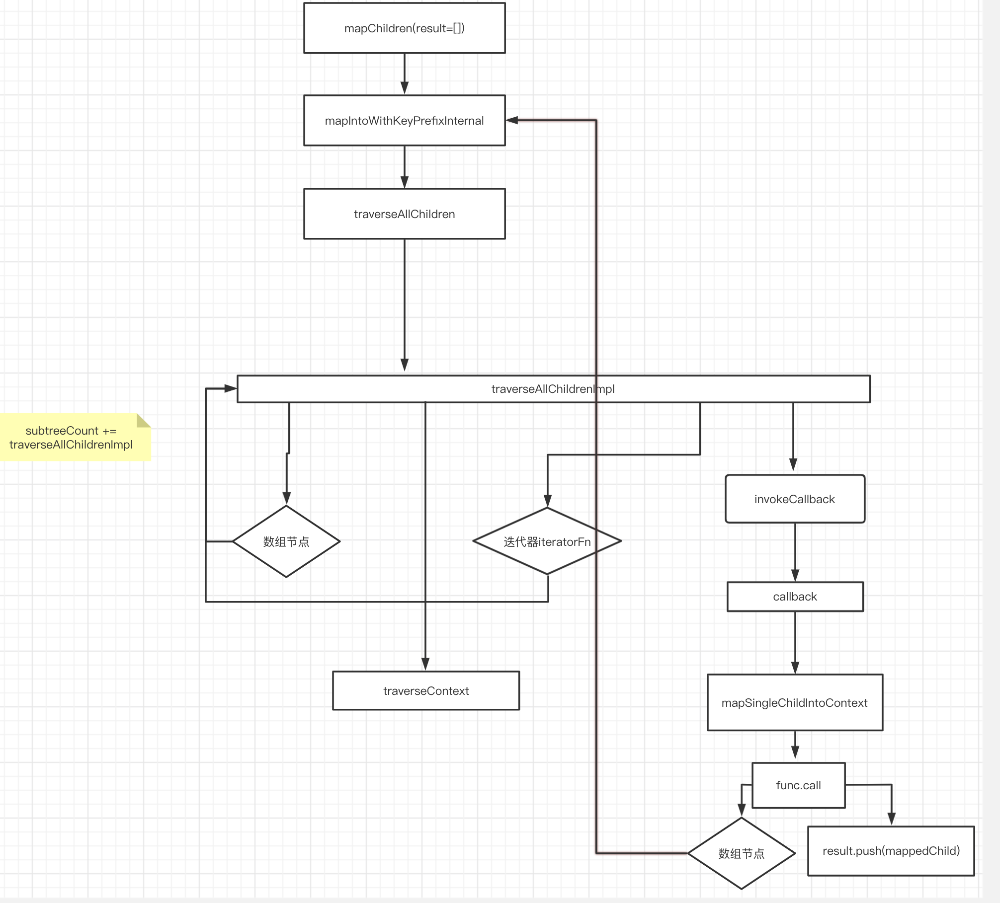

# ReactChildren

ReactChildren 主要是用来处理 children 数组。主要有以下方法：

```js
export {
  forEachChildren as forEach,
  mapChildren as map,
  countChildren as count,
  // Count the number of children
  onlyChild as only,
  toArray,
};
```

源码中 `forEachChildren`、`countChildren`、`toArray` 都是基于 mapChildren 实现的，那么我们就以**mapChildren**为例简要分析一下：

## mapChildren

```js
function mapChildren(children, func, context) {
  if (children == null) {
    return children;
  }
  const result = [];
  mapIntoWithKeyPrefixInternal(children, result, null, func, context);
  return result;
}
```

**mapIntoWithKeyPrefixInternal**

```js
function mapIntoWithKeyPrefixInternal(children, array, prefix, func, context) {
  let escapedPrefix = "";
  if (prefix != null) {
    escapedPrefix = escapeUserProvidedKey(prefix) + "/";
  }
  const traverseContext = getPooledTraverseContext(
    array,
    escapedPrefix,
    func,
    context
  );
  // 将数组展平
  traverseAllChildren(children, mapSingleChildIntoContext, traverseContext);
  releaseTraverseContext(traverseContext);
}
```

**getPooledTraverseContext**

```js
const POOL_SIZE = 10;
const traverseContextPool = [];
// 维护一个对象最大为10的池子，从这个池子取到对象去赋值，用完了清空， 防止内存抖动
// 可以循环使用，创建太多的话，也会占据内存
function getPooledTraverseContext(
  mapResult,
  keyPrefix,
  mapFunction,
  mapContext
) {
  if (traverseContextPool.length) {
    const traverseContext = traverseContextPool.pop();
    traverseContext.result = mapResult;
    traverseContext.keyPrefix = keyPrefix;
    traverseContext.func = mapFunction;
    traverseContext.context = mapContext;
    traverseContext.count = 0;
    return traverseContext;
  } else {
    return {
      result: mapResult,
      keyPrefix: keyPrefix,
      func: mapFunction,
      context: mapContext,
      count: 0,
    };
  }
}
```

getPooledTraverseContext 就是从 pool 里面找一个对象，releaseTraverseContext 会把当前的 context 对象清空然后放回到 pool 中。
**releaseTraverseContext**

```js
function releaseTraverseContext(traverseContext) {
  // clear attrs
  if (traverseContextPool.length < POOL_SIZE) {
    traverseContextPool.push(traverseContext);
  }
}
```

releaseTraverseContext 会把当前的 context 对象清空然后放回到 pool 中。

那么按照这个流程来看，是不是 pool 永远都只有一个值呢，毕竟 pop 之后操作完了就 push 了，这么循环着。答案肯定是否的，这就要讲到 React.Children.map 的一个特性了，那就是对每个节点的 map 返回的如果是数组，那么还会继续展开，这是一个递归的过程。接下去我们就来看看。

**traverseAllChildren 将数组打平**

```js
function traverseAllChildren(children, callback, traverseContext) {
  if (children == null) {
    return 0;
  }

  return traverseAllChildrenImpl(children, "", callback, traverseContext);
}
```

traverseAllChildren 只做了了一个简单的判断，实现逻辑都在 traverseAllChildrenImpl 中。

**traverseAllChildrenImpl**

```js
function traverseAllChildrenImpl(
  children,
  nameSoFar,
  callback,
  traverseContext
) {
  const type = typeof children;

  if (type === "undefined" || type === "boolean") {
    // All of the above are perceived as null.
    children = null;
  }
  // invokeCallback=true,才触发callBack执行
  let invokeCallback = false;

  if (children === null) {
    invokeCallback = true;
  } else {
    // children 如果是字符串，则
    switch (type) {
      case "string":
      case "number":
        invokeCallback = true;
        break;
      case "object":
        switch (children.$$typeof) {
          //如果props.children是单个ReactElement/PortalElement的话 必会触发invokeCallback=true
          case REACT_ELEMENT_TYPE:
          case REACT_PORTAL_TYPE:
            invokeCallback = true;
        }
    }
  }
  // 处理非数组的情况
  if (invokeCallback) {
    callback(
      traverseContext,
      children,
      // 如果它是唯一的子元素，则将该名称视为包装在数组中
      // 所以如果孩子的数量增加，它是一致的
      nameSoFar === "" ? SEPARATOR + getComponentKey(children, 0) : nameSoFar
    );
    return 1;
  }

  let child;
  let nextName;
  let subtreeCount = 0; // Count of children found in the current subtree.
  const nextNamePrefix =
    nameSoFar === "" ? SEPARATOR : nameSoFar + SUBSEPARATOR;

  if (Array.isArray(children)) {
    for (let i = 0; i < children.length; i++) {
      child = children[i];
      nextName = nextNamePrefix + getComponentKey(child, i);
      // 是数组就递归执行
      subtreeCount += traverseAllChildrenImpl(
        child,
        nextName,
        callback,
        traverseContext
      );
    }
  } else {
    // 迭代器处理
    const iteratorFn = getIteratorFn(children);
    if (typeof iteratorFn === "function") {
      if (disableMapsAsChildren) {
        invariant(
          iteratorFn !== children.entries,
          "Maps are not valid as a React child (found: %s). Consider converting " +
            "children to an array of keyed ReactElements instead.",
          children
        );
      }

      const iterator = iteratorFn.call(children);
      let step;
      let ii = 0;
      while (!(step = iterator.next()).done) {
        child = step.value;
        nextName = nextNamePrefix + getComponentKey(child, ii++);
        // 遍历
        subtreeCount += traverseAllChildrenImpl(
          child,
          nextName,
          callback,
          traverseContext
        );
      }
    } else if (type === "object") {
      // 如果没有迭代器，且是一个对象则报错
      let addendum = "";
      const childrenString = "" + children;
      // 类型判断不正确 抛出错误
      invariant(
        false,
        "Objects are not valid as a React child (found: %s).%s",
        childrenString === "[object Object]"
          ? "object with keys {" + Object.keys(children).join(", ") + "}"
          : childrenString,
        addendum
      );
    }
  }

  return subtreeCount;
}
```

上来对传来的 children 做了检测, 如果是 **数组** 或者 **迭代器** 就继续递归自己。
traverseContext 里面包含着以下属性：

```js
{
    // map 结果
    result: mapResult,
    // key 前缀
    keyPrefix: keyPrefix,
    // map之后的function
    func: mapFunction,
    // 如果func中有this，那么this最终指向 context
    context: mapContext,
    // 计数
    count: 0,
}

```

重点是 invokeCallback 为 true 的时候 执行 callback, 也就是传入的 mapSingleChildIntoContext 方法

**mapSingleChildIntoContext**

```js
function mapSingleChildIntoContext(bookKeeping, child, childKey) {
  const { result, keyPrefix, func, context } = bookKeeping;
  // func 就是我们在 React.Children.map(this.props.children, c => c)中传入的第二个函数参数
  let mappedChild = func.call(context, child, bookKeeping.count++);
  if (Array.isArray(mappedChild)) {
    // 数组递归展平
    // React.Children.map(this.props.children, c => [c, [c, [c]]])
    mapIntoWithKeyPrefixInternal(mappedChild, result, childKey, (c) => c);
  } else if (mappedChild != null) {
    if (isValidElement(mappedChild)) {
      // 创建一个新的ReactElement
      mappedChild = cloneAndReplaceKey(
        mappedChild,
        // Keep both the (mapped) and old keys if they differ, just as
        // traverseAllChildren used to do for objects as children
        keyPrefix +
          (mappedChild.key && (!child || child.key !== mappedChild.key)
            ? escapeUserProvidedKey(mappedChild.key) + "/"
            : "") +
          childKey
      );
    }
    result.push(mappedChild);
  }
}
```

mapSingleChildIntoContext 这个方法其实就是调用 React.Children.map(children, callback)这里的 callback，就是我们传入的第二个参数，并得到 map 之后的结果。注意重点来了，如果 map 之后的节点还是一个数组，那么再次进入 mapIntoWithKeyPrefixInternal，那么这个时候我们就会再次从 pool 里面去 context 了，而 pool 的意义大概也就是在这里了，如果循环嵌套多了，可以减少很多对象创建和 gc 的损耗。

> 频繁的对象创建,频繁的垃圾回收让 GC 没有机会工作

## 验证

看完上面的流程,个人做了自己的理解,就是把一个多维数组,铺平成一个一维数组,按照深度优先的规则.下面来验证下自己的这个总结是否正确.

我们在看看 ReactChildren-test.js 文件下面的测试用例，如 219 行的一个 🌰 来说

```js
it("should be called for each child in nested structure", () => {
  const zero = <div key="keyZero" />;
  const one = null;
  const two = <div key="keyTwo" />;
  const three = null;
  const four = <div key="keyFour" />;
  const five = <div key="keyFive" />;

  const context = {};
  const callback = jest.fn().mockImplementation(function(kid) {
    return kid;
  });

  const instance = <div>{[[zero, one, two], [three, four], five]}</div>;

  function assertCalls() {
    expect(callback).toHaveBeenCalledTimes(6);
    expect(callback).toHaveBeenCalledWith(zero, 0);
    expect(callback).toHaveBeenCalledWith(one, 1);
    expect(callback).toHaveBeenCalledWith(two, 2);
    expect(callback).toHaveBeenCalledWith(three, 3);
    expect(callback).toHaveBeenCalledWith(four, 4);
    expect(callback).toHaveBeenCalledWith(five, 5);
    callback.mockClear();
  }

  React.Children.forEach(instance.props.children, callback, context);
  assertCalls();

  const mappedChildren = React.Children.map(
    instance.props.children,
    callback,
    context
  );
  assertCalls();
});
```

我们自己再写个简单 demo 验证下：

```js
const arr = [["1", "2"], ["3"], ["4", ["1", "1"]]];

function ReactChildren() {
  return Children.map(arr, (child, index) => {
    return <li>{child}</li>;
  });
}

export default ReactChildren;
```

按照上面总结,应该依此排列的为 1,2,3,4,1,1, 我们访问页面发现也是正确的.

## 总结

使用 React.Children 可以更好的保护我们的程序,我们可以用来替换常规的 map 方法. 它可以把一个多维数组(或者嵌套的 Element)铺平成一个一维数组,按照深度优先遍历的规则,最后再渲染我们的 child,但是 传入的 child 不能是一个 object 对象。

