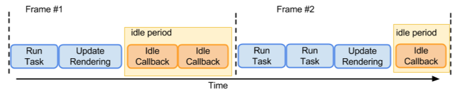
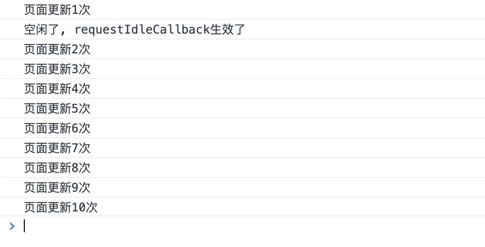
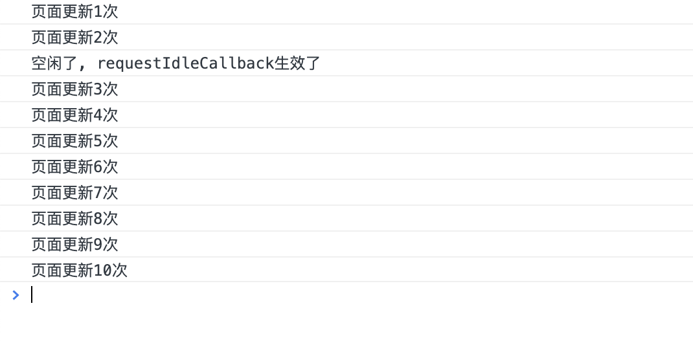

# requestIdleCallback

`requestIdleCallback` 用于调度对 CPU 和内存影响较大的任务，以确保它们在浏览器空闲时执行，不会影响到。`requestIdleCallback`在渲染以后执行。

## 原理

一般情况下浏览器的刷新频率是 60HZ，那么一帧的时间就是大约 16ms。浏览器在一帧内会做哪些事情：

1. 处理用户输入事件。
2. javascript 执行。
3. requestAnimationFrame 调用。
4. 布局 Layout。
5. 绘制 Point。
6. requestIdleCallback （是否剩余时间）

**如果一帧的第二步的执行时间超过了 16ms，那么就会影响到下一帧的绘制。（一直空闲状态下，requestIdleCallback 返回的剩余时间最长可以到 50ms）所以可以将一些比较耗时的任务切片放在 requestIdleCallback 中执行**

它接收一个回调函数作为参数，该回调函数会在浏览器空闲时被调用。这意味着 `requestIdleCallback` 的优先级比 `requestAnimationFrame` 更低，因此它更适合用于执行那些不需要及时更新的任务，例如计算、数据处理和网络请求。


但是在浏览器繁忙的时候，可能不会有盈余时间，这时候 `requestIdleCallback` 回调可能就不会被执行。 为了避免饿死，可以通过 `requestIdleCallback` 的第二个参数指定一个超时时间.

## 参数

```js
requestIdleCallback(callback, options);
```

**callback 必传**

一个在事件循环空闲时即将被调用的函数的引用。函数会接收到一个名为 `IdleDeadline` 的参数，这个参数可以获取当前空闲时间以及回调是否在超时时间前已经执行的状态。IdleDeadline 的类型如下：

```typescript
interface IdleDeadline {
  // 是否超时，如果任务规定了超时时间,过了超时时间还没被执行，会被放进事件队列中执行，然后didTimeout为true。
  readonly didTimeout: boolean;
  // 一个函数，返回你的空闲时间，如果你的任务需要的时间超过这个时间，浏览器一样会卡顿
  timeRemaining(): DOMHighResTimeStamp;
}
```

**options(可选)**

可选的配置参数。具有如下属性： `timeout`：如果指定了 timeout，并且有一个正值，而回调在 `timeout` 毫秒过后还没有被调用，那么回调任务将放入事件循环中排队，即使这样做有可能对性能产生负面影响。这个时间跟上面的 `didTimeout` 息息相关。

> 强烈建议使用 timeout 选项进行必要的工作，否则可能会在触发回调之前经过几秒钟。

## 返回值

一个 ID，类似于定时器，可以把 ID 传入到 `Window.cancelIdleCallback()`方法取消回调。

## 示例 1

React 正是使用了此特性实现了**Fiber 的可中断调度**。下面让我们看一个例子：

```js
// 进程阻塞函数
function sleep(date) {
  let flag = true;
  const now = Date.now();
  while (flag) {
    if (Date.now() - now > date) {
      flag = false;
    }
  }
}

function work() {
  sleep(2000); // 模拟主线程任务执行时间 2000ms

  requestIdleCallback(() => {
    console.log("空闲时间1");
    sleep(1000);
    console.log("空闲时间1回调任务执行完成");
  });

  requestIdleCallback(() => {
    console.log("空闲时间2");
  });
}

btn1.addEventListener("click", work);
```

执行结果： **点击 btn1 >> 等待 2s >> 打印空闲时间 1 >> 等待 1S >> 打印空闲时间 1 回调任务执行完成 >> 打印 空闲时间 2**  
可以看出，当 `sleep` 结束之后，主线程空闲， `requestIdleCallback` 请求到主线程使用权限，立即开始执行 `callback` 占用主线程，直到 `sleep` 结束，第二个 `requestIdleCallback` 获取到主线程空闲开始执行。在这里， `requestIdleCallback` 与 `setTimeout(callback,0)` 的执行方式是极其相似的，如果主线程阻塞，那么 cb 就会一直等待，只是 `requestIdleCallback` 可以获取到剩余工作时间，`setTimeout` 是指定最少要等待时间之后才会执行.

## 示例 2

模拟页面更新：

```js
let btn1 = document.getElementById("btn1");

function sleep(date) {
  let flag = true;
  const now = Date.now();
  while (flag) {
    if (Date.now() - now > date) {
      flag = false;
    }
  }
}

function renderElement(txt) {
  const p = document.createElement("p");
  p.innerText = txt;

  return p;
}

let taskLen = 10;
let update = 0;
function work2() {
  document.body.appendChild(renderElement(`任务还剩 ${taskLen}`));
  console.log(`页面更新${++update}次`);
  taskLen--;
  if (taskLen) {
    requestAnimationFrame(work2);
  }
}

btn1.addEventListener("click", () => {
  requestAnimationFrame(work2);
  window.requestIdleCallback(() => {
    console.log("空闲了, requestIdleCallback生效了");
  });
});
```

结果如下:


`requestIdleCallback` 在第一帧过后就执行,原因第一帧过后就出现了空闲时段。  
如果我们把每一帧的时间塞满，`requestIdleCallback`会在什么时间执行呢？

```js
function work2() {
  document.body.appendChild(renderElement(`任务还剩 ${taskLen}`));
  console.log(`页面更新${++update}次`);
  sleep(1000);
  taskLen--;
  if (taskLen) {
    requestAnimationFrame(work2);
  }
}
```

如上： 直到所有的页面更新完之后才执行`requestIdleCallback`,这种情况就是 **饿死**。根据 MDN 上说明的，添加 timeout：

```js
btn1.addEventListener("click", () => {
  requestAnimationFrame(work2);
  window.requestIdleCallback(
    () => {
      console.log("空闲了, requestIdleCallback生效了");
    },
    { timeout: 1000 }
  );
});
```

结果如下：

可以看出， `requestIdleCallback` 在第三次更新之前执行了。这就符合 MDN 上说的，如果时间过了 timeout 还没有执行，**将 callback 添加到 事件队列的宏任务中，也就是第三次 EventLoop 的顶部**。

## 示例 3

模拟 `React` 里面的 workLoop 执行过程，其实就是使用了`requestIdleCallback`的特性，使 Fiber 能够被打断，并在浏览器空闲的时间继续执行。

```js
function sleep(delay) {
  //在JS里如何实现睡眠的功能 t=当前时间
  for (var start = Date.now(); Date.now() - start <= delay; ) {}
}
let allStart = Date.now();
// fiber是把整个任务分成很多个小任务，每次执行一个任务
// 执行完成后会看看有没剩余时间，如果有继续下一个任务，如果没有放弃执行，交给浏览器进行调度
const works = [
  () => {
    console.log("第1个任务开始");
    //while (true) { }
    sleep(20); //一帧16.6 因为此任务的执行时间已经超过了16.6毫秒，所需要把控制 权交给浏览器
    console.log("第1个任务结束 ");
  },
  () => {
    console.log("第2个任务开始");
    sleep(20);
    console.log("第2个任务结束 ");
  },
  () => {
    console.log("第3个任务开始");
    sleep(20);
    console.log("第3个任务结束 ");
    console.log(Date.now() - allStart);
  },
];

// deadline是一个对象 有两个属性
// timeRemaining()可以返回此帧还剩下多少时间供用户使用
// didTimeout 此callback任务是否超时
function workLoop(deadline) {
  console.log(`本帧的剩余时间为${parseInt(deadline.timeRemaining())}`);
  //如果此帧的剩余时间超过0,或者此已经超时了, 必须执行work
  while (
    (deadline.timeRemaining() > 1 || deadline.didTimeout) &&
    works.length > 0
  ) {
    performUnitOfWork();
  }
  //如果没有剩余时间，就需要放弃执行任务控制权，执行权交还给浏览器
  if (works.length > 0) {
    // 如果还有未完成的任务，则请求下一次的执行权
    window.requestIdleCallback(workLoop, { timeout: 1000 });
  }
}

function performUnitOfWork() {
  //shift取出数组中的第1个元素
  works.shift()();
}

//告诉 浏览器在1000毫秒后，即使你没有空闲时间也得帮我执行，因为我等不及你
requestIdleCallback(workLoop, { timeout: 1000 });
```

## 注意

1. `requestIdleCallback` 不一定会立即执行，如果当前帧的剩余时间不足以执行回调函数，那么就有可能延迟到下一帧或者等待很久才会执行，立即执行可以使用 `setTimeout`、`setInterval`代替。
2. `requestIdleCallback` 的回调函数如果逻辑复杂，会影响到之后每一帧的执行，也会导致掉帧。

3. 兼容性不好

## polyfill

目前 React 自己实现了一个。利用 `MessageChannel` 和 `requestAnimationFrame` 模拟将回调延迟到'绘制操作'之后执行:

```js
const el = document.getElementById("root");
const btn = document.getElementById("btn");
const ch = new MessageChannel();
let pendingCallback;
let startTime;
let timeout;

ch.port2.onmessage = function work() {
  // 在绘制之后被执行
  if (pendingCallback) {
    const now = performance.now();
    // 通过now - startTime可以计算出requestAnimationFrame到绘制结束的执行时间
    // 通过这些数据来计算剩余时间
    // 另外还要处理超时(timeout)，避免任务被饿死
    // ...
    if (hasRemain && noTimeout) {
      pendingCallback(deadline);
    }
  }
};

// ...

function simpleRequestIdleCallback(callback, timeout) {
  requestAnimationFrame(function animation() {
    // 在绘制之前被执行
    // 记录开始时间
    startTime = performance.now();
    timeout = timeout;
    // doSomething();
    // 调度回调到绘制结束后执行
    pendingCallback = callback;
    ch.port1.postMessage("hello");
  });
}
```
